# ASCA Stock Control - System Overview

## What Is It?

ASCA Stock Control is a multi-tenant supply chain and inventory management system for industrial coating and fabrication operations. It tracks stock from inbound delivery through to job dispatch, with AI-powered document extraction, role-based approval workflows, QR-based scanning, and full audit trails.

---

## Core Concepts

| Concept | What It Is |
|---------|-----------|
| **Company** | Multi-tenant root. All data is scoped to a company. Holds branding, SMTP config, loss factors. |
| **Stock Item** | A physical inventory item (paint, primer, thinner, rubber sheet, etc.) with SKU, cost, quantity, location. |
| **Job Card** | A work order for a fabrication/coating project. Contains line items, coating specs, and drives the approval workflow. |
| **Staff Member** | A warehouse/operations employee with a QR badge. Not a system user - they receive stock and appear in issuance records. |
| **User** | A system login (email/password) with a role: Storeman, Accounts, Manager, or Admin. |

---

## The Four Main Workflows

### 1. Job Card Lifecycle (The Core Workflow)

This is the primary flow that drives everything else.

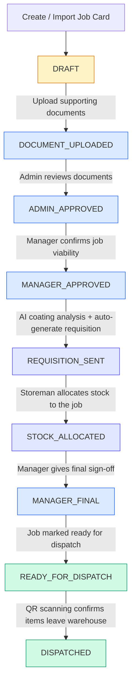

**Key points:**
- Each step creates a `JobCardApproval` record with who approved, when, and their digital signature
- Steps cannot be skipped - the workflow enforces sequential progression
- Rejection at any step sends the job back with a reason
- The coating analysis step uses AI (Claude) to parse job card notes and extract paint specifications (product, DFT ranges, coverage rates, solids by volume) then calculates exact litres required per coat

### 2. Inbound Delivery (Receiving Stock)

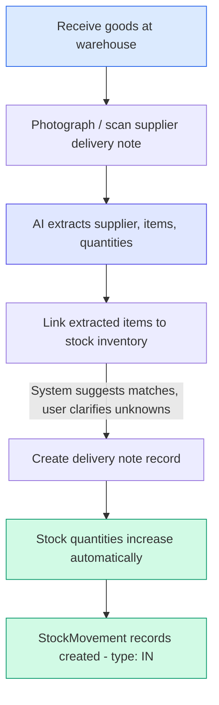

### 3. Invoice Processing (Accounts Payable)

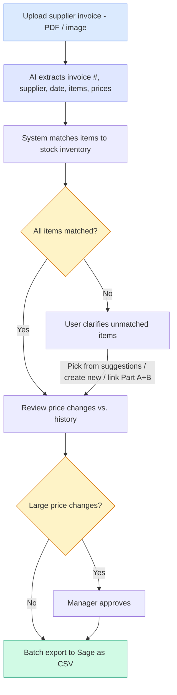

### 4. Stock Issuance (Day-to-Day Warehouse Operations)

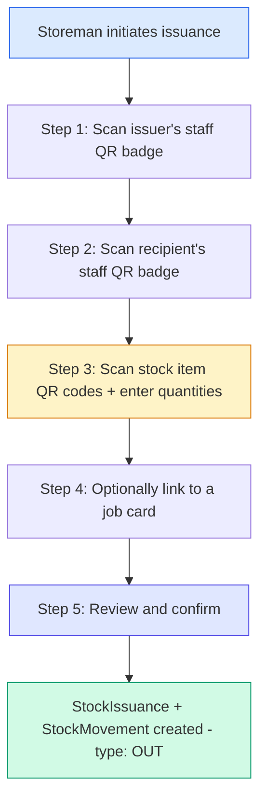

---

## Data Model (Entity Relationships)

### Tenant & Access Control

Everything is scoped to a single company. Users log in with roles; staff members are warehouse employees identified by QR badges.

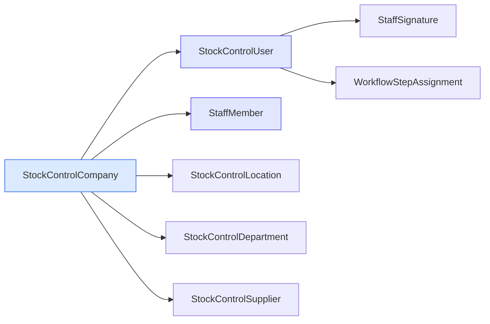

### Inventory & Stock Movements

Stock items live in locations. Every quantity change (delivery, issuance, adjustment) creates a movement record.

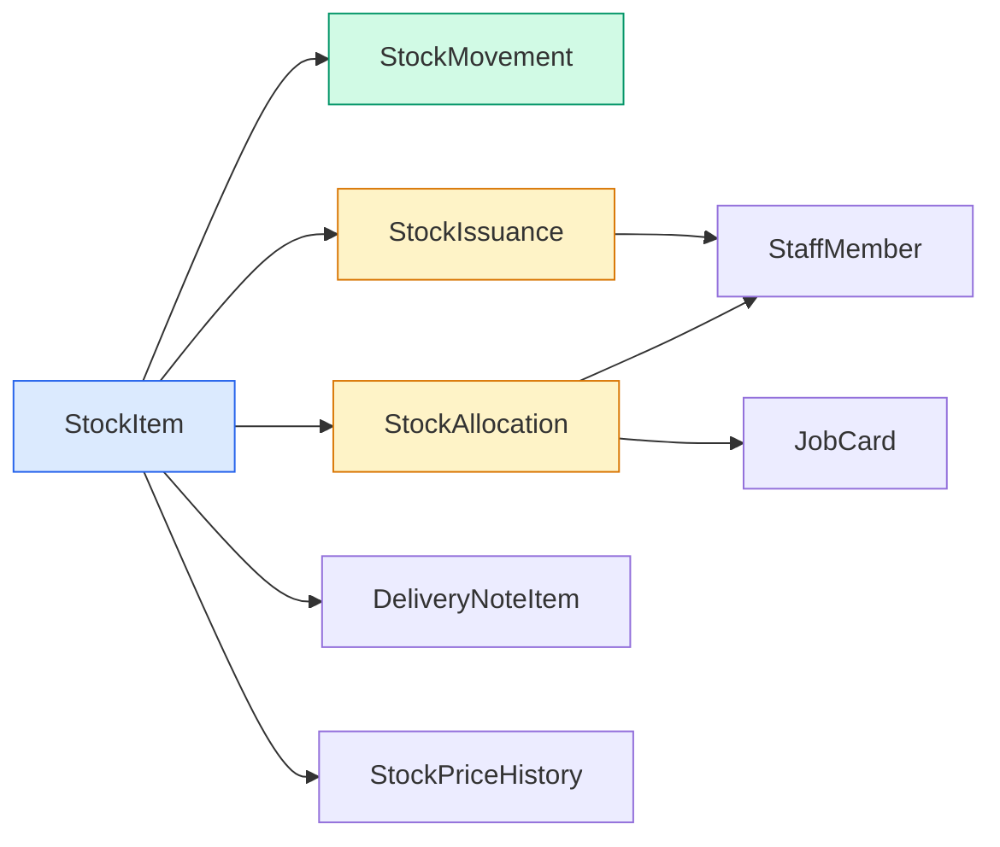

### Job Card & Workflow

A job card is the central work order. It collects line items, documents, coating analysis, approval records, and dispatch scans. Requisitions are auto-generated from it.

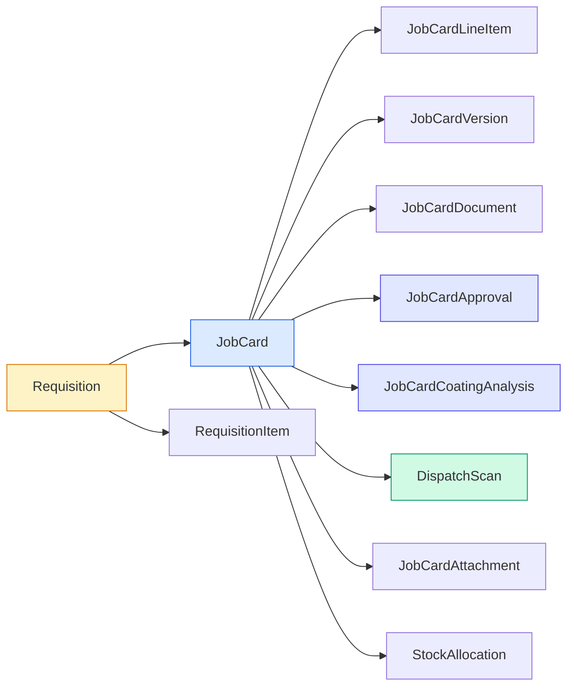

### Inbound: Deliveries & Invoices

Delivery notes record incoming stock. Supplier invoices are linked to deliveries and go through AI extraction and a clarification workflow before export.

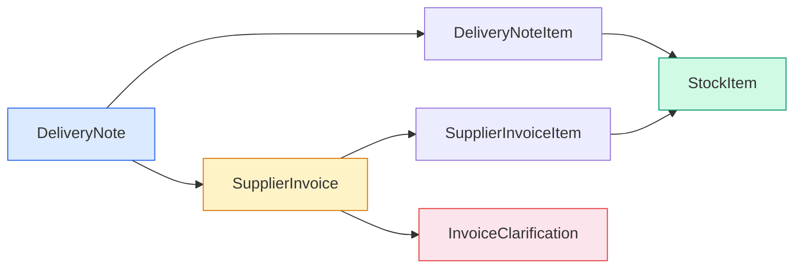

---

## Portal Pages

| Page | Path | Primary Roles | Purpose |
|------|------|--------------|---------|
| **Dashboard** | `/portal/dashboard` | All | KPIs, low-stock alerts, pending approvals, recent activity |
| **Inventory** | `/portal/inventory` | All | Stock items CRUD, import, location groups, low-stock warnings |
| **Job Cards** | `/portal/job-cards` | All | Create/import jobs, allocate stock, manage workflow |
| **Staff** | `/portal/staff` | All (edit: Manager+) | Employee roster, photos, QR badge printing |
| **Deliveries** | `/portal/deliveries` | All | Incoming stock receipt, photo capture, AI extraction |
| **Issue Stock** | `/portal/issue-stock` | Storeman+ | QR-based multi-step issuance workflow |
| **Requisitions** | `/portal/requisitions` | All | Auto-generated purchase requests from jobs or low stock |
| **Invoices** | `/portal/invoices` | Accounts+ | Upload, AI extraction, price review, Sage export |
| **Notifications** | `/portal/notifications` | All | Activity stream with action links |
| **Reports** | `/portal/reports` | Manager+ | Cost-by-job, stock valuation, movement history, staff variance |
| **Settings** | `/portal/settings` | Admin | Company details, branding, SMTP, team invites, departments, locations, RBAC |

---

## Role-Based Access

| Role | Access Level |
|------|-------------|
| **Viewer** | Dashboard, Inventory, Job Cards, Staff, Deliveries, Requisitions, Notifications (read-only) |
| **Storeman** | + Issue Stock, allocate stock, capture photos |
| **Accounts** | + Invoices (upload, clarify, export to Sage) |
| **Manager** | + Reports, approve allocations/price changes, manage invitations |
| **Admin** | Full access including Settings, RBAC config, SMTP, branding |

---

## AI-Powered Features

### Coating Analysis
- Parses job card notes using Claude to extract paint/coating specifications
- Identifies: product name, application area (external/internal), DFT range (um), solids by volume %, coverage rate (m2/L)
- Calculates exact litres required per coat based on job card m2 areas
- Runs stock assessment: compares required quantities against current inventory
- Flags unverified products that need Technical Data Sheets (TDS)

### Document Extraction
- **Delivery notes**: Photograph a paper delivery note, AI extracts supplier, items, and quantities
- **Invoices**: Upload PDF/image, AI extracts invoice number, supplier, date, line items with prices
- Item matching with confidence scores; unmatched items enter a clarification workflow

### Item Identification
- Upload a photo + text description of an unknown item
- Vision API categorises and suggests matching stock items

---

## Stock Movement Types

Every quantity change creates a `StockMovement` audit record:

| Type | Trigger | Direction |
|------|---------|-----------|
| `IN` | Delivery received | + quantity |
| `OUT` | Issuance or dispatch | - quantity |
| `ADJUSTMENT` | Manual correction (stock take) | +/- quantity |

Each movement records: reference type (ALLOCATION, DELIVERY, IMPORT, ISSUANCE, MANUAL, STOCK_TAKE), reference ID, user, and notes.

---

## Dispatch (Physical Verification)

The final step of the job card workflow uses QR scanning to verify that allocated items physically leave the warehouse:

1. Start dispatch session for a job card
2. Scan each stock item's QR code, confirm quantity
3. System creates `DispatchScan` records
4. Track progress: allocated vs. dispatched
5. Complete dispatch - job card moves to DISPATCHED status

---

## Key Technical Patterns

- **Multi-tenancy**: All queries scoped by `company_id` via JWT auth guard
- **Audit trail**: StockMovement, JobCardApproval, DispatchScan, StockIssuance all capture user context
- **Workflow state machine**: JobCard.workflowStatus enforces sequential 9-step progression
- **Atomic stock updates**: Delivery creation atomically creates items + updates quantities + creates movements
- **Price tracking**: SupplierInvoiceItem tracks previous price, flags changes above threshold
- **Offline support**: Frontend queues mutations when offline, syncs on reconnection
- **Push notifications**: Optional browser push via service worker

---

## Reporting

| Report | What It Shows |
|--------|--------------|
| **Cost by Job** | Total stock cost allocated per job card, with item breakdown |
| **Stock Valuation** | Inventory value by category for balance sheet |
| **Movement History** | Full transaction log with date range and type filters |
| **Staff Stock Variance** | Per-staff allocation analysis for reconciliation and anomaly detection |

All reports export to CSV.

---

## Suggestions for Re-Architecting the Interface

The current system is feature-complete but presents a flat list of 12 navigation items with no clear guidance on what to do first or how the pieces connect. For someone coming in cold, this can feel overwhelming. Below are suggestions to make the workflow more self-evident.

### 1. Replace the Flat Navigation with a Workflow-Centric Home Page

Instead of a sidebar with 12 equal-weight items, the dashboard should present the system as **three lanes** that correspond to the three real-world activities:

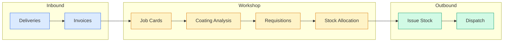

Each lane shows a count of items at each stage (e.g. "3 deliveries pending extraction, 2 invoices need clarification"). Clicking a count takes you straight to the filtered list. Inventory, Staff, Reports, and Settings become secondary navigation (top bar or gear icon) since they are reference data, not workflow steps.

### 2. Guided Onboarding Wizard

When a new company or user is created, present a sequential setup checklist:

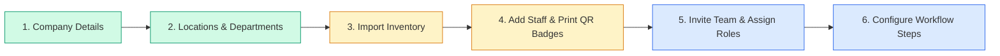

Mark each step complete as the user finishes it. Until all steps are done, the dashboard prominently shows the checklist rather than KPIs.

### 3. Contextual "What's Next" Prompts

On each detail page, show a clear call-to-action for the next logical step:

- **Job Card (DRAFT)**: "Upload supporting documents to proceed" with an upload button
- **Job Card (ADMIN_APPROVED)**: "Awaiting manager approval" with the approver's name
- **Delivery Note (extracted)**: "Link 4 extracted items to your inventory" with a button
- **Invoice (needs_clarification)**: "Answer 2 questions to continue" with a badge

This removes the need to understand the workflow upfront - the system tells you what to do.

### 4. Consolidate Job Card + Coating Analysis + Requisition into One View

Currently these are separate pages. Since coating analysis and requisitions are generated from job cards and only make sense in that context, they should be **tabs or sections within the job card detail page** rather than top-level navigation items.

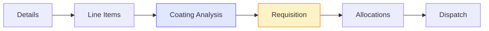

The requisitions list page can remain for accounts staff who need a cross-job view, but the primary interaction should happen inside the job card.

### 5. Simplify the Issue Stock Flow for Repeat Operations

The current 5-step QR scanning flow works well for the first time, but warehouse staff issue stock dozens of times a day. Add:

- **Quick issue**: Pre-select the issuer (logged-in user's linked staff member) so step 1 is skipped
- **Favourites**: Remember frequently issued item + recipient combinations
- **Batch mode**: Stay on the scanning screen after submission instead of resetting to step 1

### 6. Visual Workflow Timeline on Job Cards

Replace the status badge with a **horizontal stepper** showing all 9 workflow stages. Completed steps show a green tick with the approver's name and timestamp. The current step is highlighted. Future steps are greyed out. This gives an instant visual read of where a job is in the process.

### 7. Role-Specific Landing Pages

Different roles have different daily priorities:

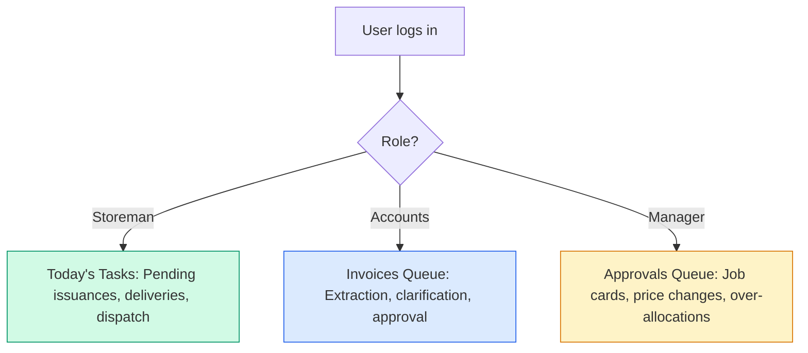

The current dashboard tries to serve everyone and ends up serving no one particularly well.

### 8. Reduce Cognitive Load on the Inventory Page

The inventory page currently shows every field in a dense table. Consider:

- **Card view as default** with photo, name, quantity, and a stock level indicator bar
- **Table view as opt-in** for power users who need to see all columns
- **Smart grouping**: Default to grouping by location (where the physical stock lives) rather than a flat alphabetical list
- **Visual stock indicators**: Red/amber/green dots instead of requiring users to compare quantity vs. min level mentally

### 9. Unified Search

Add a global search bar (Cmd+K / Ctrl+K) that searches across job cards, stock items, staff, deliveries, and invoices. Return results grouped by type. This lets experienced users navigate without the menu entirely.

### 10. Inline Help and Terminology Glossary

Add a small "?" icon next to domain-specific terms (DFT, CVN, PSL, NB, OD, m2) that shows a tooltip with a plain-English explanation. New users in the coating industry will know these; new users from IT or accounts may not.
