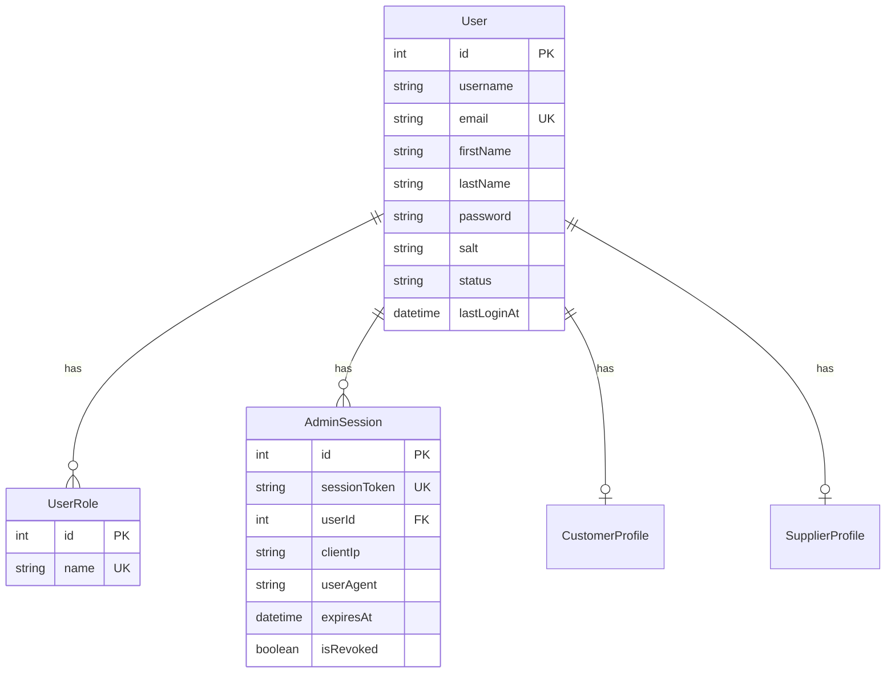

# Annix-Sync Data Model Diagrams

This document contains Entity-Relationship diagrams for all major domains in the system.

---

## 1. User & Authentication Domain

---

## 2. Customer Domain

---

## 3. Supplier Domain

---

## 4. RFQ & BOQ Domain

---

## 5. Pipe Specifications Domain

---

## 6. Flange Domain

---

## 7. Fitting Domain

---

## 8. Drawing & Document Domain

---

## 9. Audit & Workflow Domain

---

## 10. Mining Industry Domain

---

## 11. Coating Specifications Domain

---

## 12. Specialized Pipe Materials Domain

---

## 13. Structural Steel Domain

---

## Entity Relationship Summary

| Domain | Entities | Primary Purpose |
|--------|----------|-----------------|
| User & Auth | 3 | Authentication and session management |
| Customer | 9 | Customer company and user management |
| Supplier | 9 | Supplier company and capability tracking |
| RFQ & BOQ | 7 | Quote request and bill of quantities |
| Drawings | 3 | Technical drawing management |
| Pipe Specs | 5 | Pipe dimensions and pressure ratings |
| Flanges | 6 | Flange standards and dimensions |
| Fittings | 8 | Fitting types and dimensions |
| Audit | 2 | Audit logging and workflows |
| Mining | 4 | South African mining industry data |
| Coating | 3 | Coating specifications |
| HDPE/PVC | 6 | Plastic pipe specifications |
| Structural | 5 | Structural steel data |

**Total: ~70 database entities**

---

## Notes on Diagram Viewing

These diagrams use Mermaid syntax. To view them properly:
1. Use a Markdown viewer that supports Mermaid (GitHub, GitLab, VS Code with Mermaid extension)
2. Or paste the Mermaid code into https://mermaid.live for interactive viewing
3. Or use a tool like draw.io to import/recreate the diagrams
