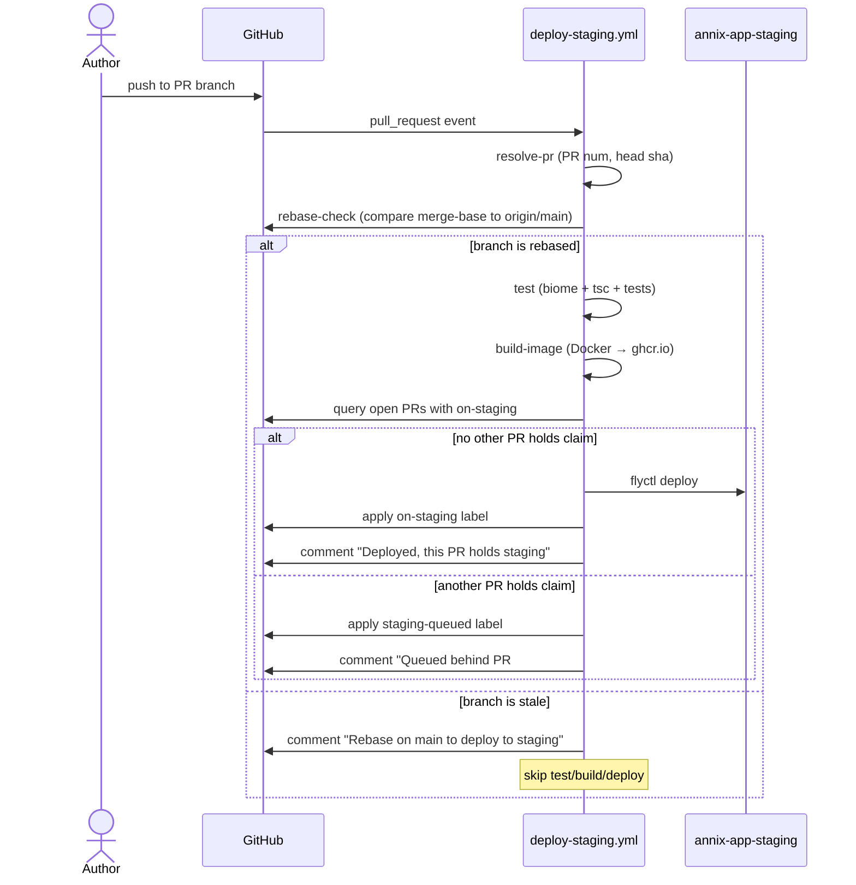
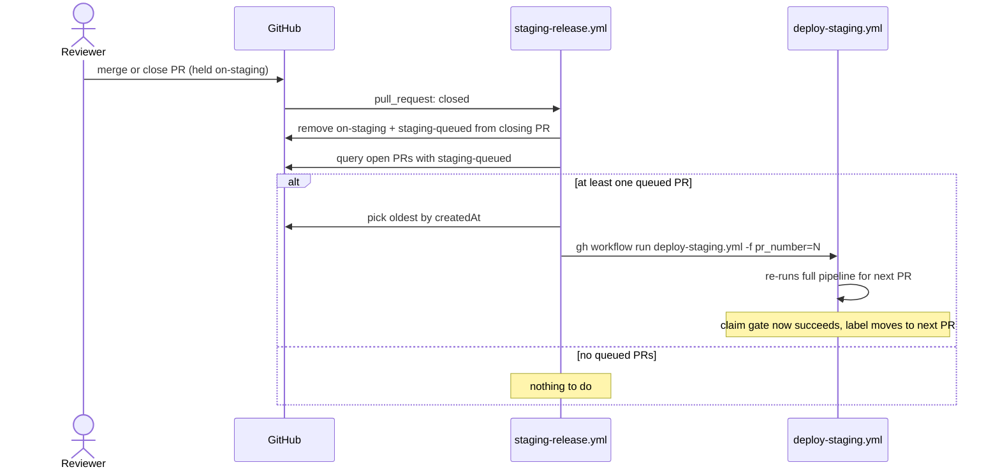
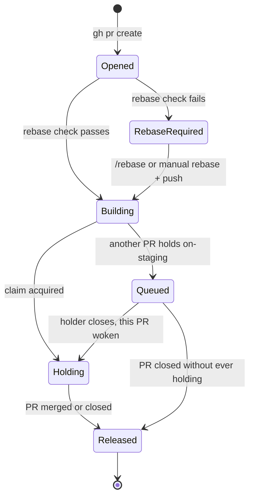
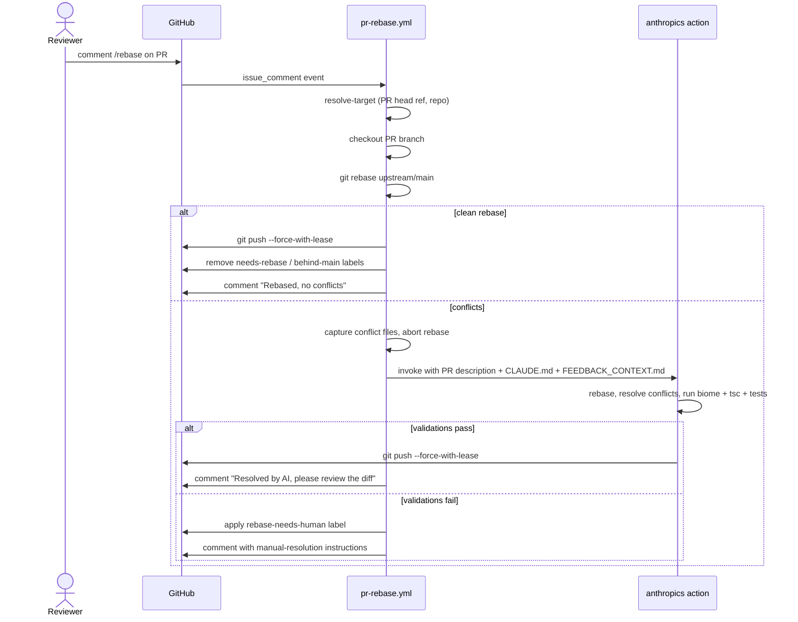
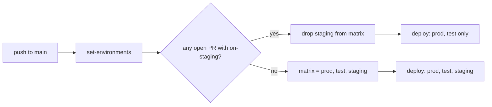

# Staging & PR Workflow

How PRs flow from open → staging → main, plus the GitHub-native automation
that backs the queue. Implemented in [issue #228][issue-228].

[issue-228]: https://github.com/AnnixInvestments/annix/issues/228

## Why this exists

Annix has a single shared staging Fly app (`annix-app-staging`). Before this
workflow landed, every PR auto-deployed to it on push, which produced two
recurring failures:

1. **Two PRs racing for the same Fly app** — the second deploy silently
   overwrote the first. Reviewers couldn't tell which fix they were looking
   at.
2. **PRs going stale unobserved** — three of five open PRs in late April
   2026 turned out to be already superseded by `main`. Nobody had
   reason to look.

The fix is a **token-passing model**: one PR holds staging at a time
(label `on-staging`), others queue (label `staging-queued`), and a daily
hygiene sweep keeps the rest from drifting. There is still exactly one
Fly staging app — no per-PR provisioning.

## Workflows at a glance

| Workflow | Trigger | What it does |
|----------|---------|--------------|
| [`deploy-staging.yml`](../../.github/workflows/deploy-staging.yml) | PR open / synchronize / reopen, or `workflow_dispatch` with `pr_number` | Rebase check → test → build image → claim staging → deploy |
| [`staging-release.yml`](../../.github/workflows/staging-release.yml) | `pull_request: closed` (when PR carries `on-staging` or `staging-queued`) | Removes labels from closing PR, wakes oldest queued PR via `workflow_dispatch` |
| [`deploy.yml`](../../.github/workflows/deploy.yml) | `push` to main, or manual `workflow_dispatch` | Deploys main to prod / test / staging; staging filtered out when `on-staging` is held |
| [`pr-hygiene.yml`](../../.github/workflows/pr-hygiene.yml) | `cron: 0 8 * * *` UTC, daily | Applies `behind-main` / `stale-7d` / `stale-14d`, auto-closes at 21d unless `keep` |
| [`pr-rebase.yml`](../../.github/workflows/pr-rebase.yml) | `/rebase` comment, `needs-rebase` label, or `workflow_dispatch` | Attempts clean rebase; on conflict invokes the AI agent with PR context |

## Staging deploy lifecycle

What happens when a PR is opened or pushed to:



## Claim release on PR close

What happens when the PR holding staging is merged or closed:



## Staging claim state machine

A single PR's view of staging:



## PR hygiene timeline

A PR with no activity walks through these stages over 21 days:

```mermaid
gantt
    title PR Hygiene Timeline (days idle)
    dateFormat X
    axisFormat %s
    section Labels
    Active (no label)        :active, 0, 7
    stale-7d + comment       :crit, 7, 7
    stale-14d                :crit, 14, 7
    section Auto-action
    "Still wanted?" comment  :milestone, 7, 0
    Auto-close (no keep)     :milestone, 21, 0
```



The `keep` label on a PR exempts it from the 21-day auto-close. Use it
when a PR is genuinely paused (waiting on upstream, design decision) but
still wanted.

## /rebase workflow



The agent gets a structured prompt that includes the PR description and
explicit pointers to `CLAUDE.md` and `.github/FEEDBACK_CONTEXT.md` —
specifically the **Scope Discipline** section, which forbids bundling
infra changes (especially `packages/*/package.json` `exports` field
changes that have crashed prod twice).

## Label reference

| Label | Owner | Meaning |
|-------|-------|---------|
| `on-staging` | `deploy-staging.yml` (success) | This PR is currently deployed to `annix-app-staging`. Removed by `staging-release.yml` on PR close. |
| `staging-queued` | `deploy-staging.yml` (claim gate) | This PR's deploy is waiting for the holder to release. Auto-removed when its deploy fires. |
| `behind-main` | `pr-hygiene.yml` (daily) | Branch is behind `origin/main`. Comment `/rebase` to fix. |
| `stale-7d` | `pr-hygiene.yml` (daily) | No activity for 7 days. A "still wanted?" comment is posted on first apply. |
| `stale-14d` | `pr-hygiene.yml` (daily) | No activity for 14 days. |
| `keep` | Manually | Exempts PR from 21-day auto-close. |
| `needs-rebase` | Manually or by another workflow | Triggers `pr-rebase.yml`. Same effect as `/rebase`. |
| `rebase-needs-human` | `pr-rebase.yml` (AI failure) | AI couldn't produce a clean, passing resolution. Manual intervention required. |

## Triggers and commands

| Trigger | Effect |
|---------|--------|
| `gh pr create` | `deploy-staging.yml` runs (rebase-check first) |
| `git push` to PR branch | `deploy-staging.yml` runs |
| `gh pr merge` or `gh pr close` (PR had `on-staging`) | `staging-release.yml` runs, wakes next queued PR |
| `/rebase` comment on PR | `pr-rebase.yml` runs |
| `needs-rebase` label applied | `pr-rebase.yml` runs |
| `gh workflow run deploy-staging.yml -f pr_number=N` | Re-deploys PR #N to staging (used internally by `staging-release.yml`) |
| `gh workflow run pr-rebase.yml -f pr_number=N` | Manual rebase attempt |
| `gh workflow run pr-hygiene.yml` | Run the daily sweep on demand |

## Main → prod / test / staging

`deploy.yml` runs on every push to `main`. It deploys to all three
environments, with one exception: **staging is filtered out of the
matrix when an open PR holds `on-staging`**.



This means:

- A PR holding staging is never overwritten by a `main` push
- Production and test deploys are never blocked by the PR queue
- When the holder merges or closes, the next `main` push will deploy
  to staging again (or `staging-release.yml` will already have woken
  the next PR, in which case the next `main` push is queued behind it)

## Process rules (from CONTRIBUTING.md)

Three human rules complement the automation:

1. **48h review SLA.** Receive review feedback within 48 hours of
   marking ready, or move to `draft`.
2. **Max 2 PRs in `ready for review` at once.** Beyond that, finish or
   draft one before opening another.
3. **One PR on staging at a time.** The PR holding `on-staging` is the
   one being reviewed. Others wait.

Without rules 1–3, the queue can fill faster than reviewers drain it,
and staging becomes a bottleneck instead of a checkpoint.

## When automation fails

| Symptom | Likely cause | Recovery |
|---------|--------------|----------|
| PR stuck `staging-queued` forever | Holder PR closed but `on-staging` wasn't removed | Run `gh workflow run staging-release.yml` manually, or remove `on-staging` from the holder PR by hand |
| Daily sweep didn't run | Cron skew or workflow disabled | Check Actions tab; trigger manually with `gh workflow run pr-hygiene.yml` |
| `/rebase` comment didn't trigger anything | Not a PR (issue), permissions issue, or comment author isn't trusted | Check workflow run logs; manually `gh workflow run pr-rebase.yml -f pr_number=N` |
| AI rebase resolution failed | Subjective conflict, validation failures (biome / tsc / tests), or scope-discipline rule blocked the change | PR will have `rebase-needs-human`; resolve manually and force-push, label is removed by next successful run |
| `main` push deployed to all 3 but you wanted to gate staging | `on-staging` label not actually applied to the holder PR | Check the holder PR's labels; `gh pr edit <num> --add-label on-staging` if missing |

## File map

```
.github/
├── FEEDBACK_CONTEXT.md       # Updated to require rebase before staging
└── workflows/
    ├── deploy.yml            # Main → prod/test/staging (filters staging on claim)
    ├── deploy-staging.yml    # PR → staging, with rebase gate + claim
    ├── staging-release.yml   # On PR close: release claim, wake next
    ├── pr-hygiene.yml        # Daily 08:00 UTC sweep
    └── pr-rebase.yml         # /rebase + AI-assisted resolution
CONTRIBUTING.md               # PR lifecycle, label vocabulary, process rules
docs/ways-of-working/
└── STAGING_PR_WORKFLOW.md    # This file
```

## See also

- [`CONTRIBUTING.md`](../../CONTRIBUTING.md) — short version of the rules and labels
- [`.github/FEEDBACK_CONTEXT.md`](../../.github/FEEDBACK_CONTEXT.md) — how feedback PRs interact with this workflow (must rebase before staging)
- [`CLAUDE.md`](../../CLAUDE.md) — project-wide conventions (Scope Discipline, Neon cron policy)
- [Issue #228][issue-228] — design discussion and rationale
